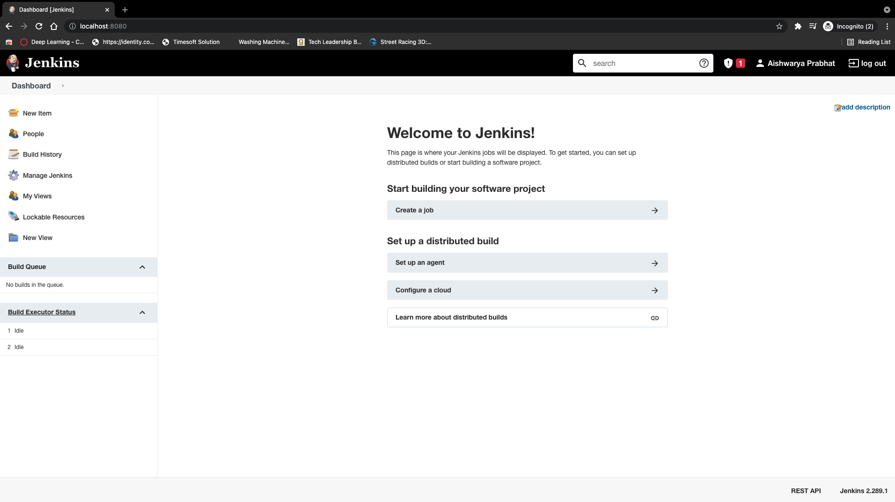

# Jenkins
Tutorial and cheatsheet for Jenkins.

## CI/CD Concept Definitions

- Continuous Integration: Delivery of development and tested code 
- Continuous Delivery: Testing in a production-like environment such as staging, QA or live-sh; delivering something that the DevOps team could take and do something with it in the productions stage but not actually putting it into production
- Continuous Deployment: Development, test, staging and going into production is all automated

### Continuous Deployment vs Continuous Delivery
- Delivery has a few manual steps prior to going live in production
- Deployment, the whole pipeline is automated

## What is Jenkins?
Google it.

## Run Jenkins on Docker
### Plain vanilla Jenkins
- Create volume for persistence
```
docker volume create jenkins_persist
```
- Pull and run Jenkins container
```
docker container run -d \
    -p 8080:8080 \
    -v jenkins_persist:/var/jenkins_home \
    --name jenkins-local \
    jenkins/jenkins:lts
```
- Get initial password from within the container using exec
```
docker container exec \
    jenkins-local \
    sh -c "cat /var/jenkins_home/secrets/initialAdminPassword"
```
- Go to `http://localhost:8080`


### Jenkins that can talk to Docker on your system
- Install Docker on based jenkins image
```
FROM jenkins/jenkins:lts
USER root

RUN mkdir -p /tmp/download && \
 curl -L https://download.docker.com/linux/static/stable/x86_64/docker-18.03.1-ce.tgz | tar -xz -C /tmp/download && \
 rm -rf /tmp/download/docker/dockerd && \
 mv /tmp/download/docker/docker* /usr/local/bin/ && \
 rm -rf /tmp/download && \
 groupadd -g 999 docker && \
 usermod -aG staff,docker jenkins

USER jenkins
```
- If volume doesn't already exist, create volume
```
docker volume create jenkins_persist
```
- Run Jenkins on Docker container with the right volumes mounted
```
docker run -p 8080:8080 -p 5000:5000 -v jenkins_persist:/var/jenkins_home -v /var/run/docker.sock:/var/run/docker/sock --name jenkins -d jenkins-docker
```

## Jenkins DSL
### What is Jenkins DSL?
- It is a plugin that allows you to define jobs in a prgrammatic form with minimal effort
- DSL = domain specific language
- You can describe jobs using a groovy based language
- Groovy = scripting language for Java platform; simpler and more dynamic

### Purpose of DSL
- Designed to make it easier to manage jobs
- For a few jobs, using the UI is the easiest way
- When the jobs grow, maintaing becomes difficult and requires a lot of manual work
- DSL plugin solves this problem
- Additional benefits: version control, history, audit log, easier job restore when something goes wrong
