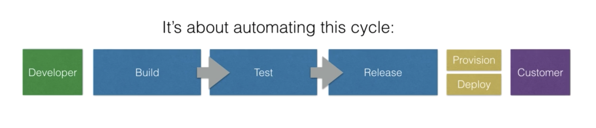
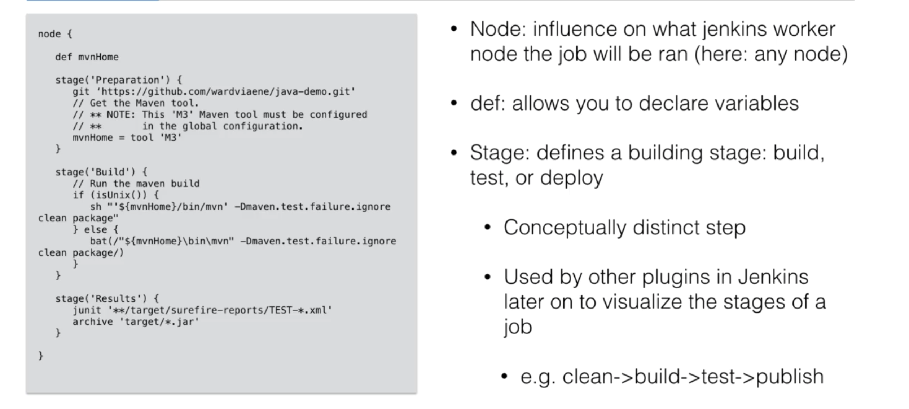

# Jenkins
Tutorial and cheatsheet for Jenkins.

## CI/CD Concept Definitions

- Continuous Integration: Delivery of development and tested code 
- Continuous Delivery: Testing in a production-like environment such as staging, QA or live-sh; delivering something that the DevOps team could take and do something with it in the productions stage but not actually putting it into production
- Continuous Deployment: Development, test, staging and going into production is all automated

### Continuous Deployment vs Continuous Delivery
- Delivery has a few manual steps prior to going live in production
- Deployment, the whole pipeline is automated

## What is Jenkins?
Google it.

## Run Jenkins on Docker
### Plain vanilla Jenkins
- Create volume for persistence
```
docker volume create jenkins_persist
```
- Pull and run Jenkins container
```
docker container run -d \
    -p 8080:8080 \
    -v jenkins_persist:/var/jenkins_home \
    --name jenkins-local \
    jenkins/jenkins:lts
```
- Get initial password from within the container using exec
```
docker container exec \
    jenkins-local \
    sh -c "cat /var/jenkins_home/secrets/initialAdminPassword"
```
- Go to `http://localhost:8080`


### Jenkins inside a Docker container that can talk to Docker on your system
- Install Docker on based jenkins image
```
FROM jenkins/jenkins:lts
USER root

RUN mkdir -p /tmp/download && \
 curl -L https://download.docker.com/linux/static/stable/x86_64/docker-18.03.1-ce.tgz | tar -xz -C /tmp/download && \
 rm -rf /tmp/download/docker/dockerd && \
 mv /tmp/download/docker/docker* /usr/local/bin/ && \
 rm -rf /tmp/download && \
 groupadd -g 999 docker && \
 usermod -aG staff,docker jenkins
```
`docker build . -t jenkins-docker -f Dockerfile-Jenkins`
- If volume doesn't already exist, create volume
```
docker volume create jenkins_persist
```
- Run Jenkins on Docker container with the right volumes mounted
```
docker run -p 8080:8080 -p 5000:5000 -v jenkins_persist:/var/jenkins_home -v /var/run/docker.sock:/var/run/docker.sock --name jenkins -d jenkins-docker
```
- Verify that Dockeer is accessible from within the container
```
docker exec -it jenkins sh
### Inside container ###
docker ps
```


## Jenkins DSL
### What is Jenkins DSL?
- It is a plugin that allows you to define jobs in a prgrammatic form with minimal effort
- DSL = domain specific language
- You can describe jobs using a groovy based language
- Groovy = scripting language for Java platform; simpler and more dynamic

### Purpose of DSL
- Designed to make it easier to manage jobs
- For a few jobs, using the UI is the easiest way
- When the jobs grow, maintaing becomes difficult and requires a lot of manual work
- DSL plugin solves this problem
- Additional benefits: version control, history, audit log, easier job restore when something goes wrong

### Example 1: Simple commands
```
job('NodeJS example') {
    scm {
        git('git://github.com/wardviaene/docker-demo.git') {  node -> // is hudson.plugins.git.GitSCM
            node / gitConfigName('DSL User')
            node / gitConfigEmail('jenkins-dsl@newtech.academy')
        }
    }
    triggers {
        scm('H/5 * * * *')
    }
    wrappers {
        nodejs('nodejs') // this is the name of the NodeJS installation in 
                         // Manage Jenkins -> Configure Tools -> NodeJS Installations -> Name
    }
    steps {
        shell("npm install")
    }
}
```
- Creates one job based on the job
- scm (software config management)
  - we define address of git repo
  - name and email are used to configure the git client
  - job will fail without this
- triggers
  - how often will we build it? (every 5 mins)
- wrappers
  - this is specifically for 'importing' the nodejs plugin and the nodejs we install
- steps
  - the actual steps to run 

#### How to use?
- Install Job DSL plugin
- Configure job


- We need script approval (safety mechanism) before we can use the script
```
Started by user Aishwarya Prabhat
Running as SYSTEM
Building in workspace /var/jenkins_home/workspace/seed project
The recommended git tool is: NONE
No credentials specified
 > git rev-parse --resolve-git-dir /var/jenkins_home/workspace/seed project/.git # timeout=10
Fetching changes from the remote Git repository
 > git config remote.origin.url https://github.com/aishwaryaprabhat/Jenkins # timeout=10
Fetching upstream changes from https://github.com/aishwaryaprabhat/Jenkins
 > git --version # timeout=10
 > git --version # 'git version 2.20.1'
 > git fetch --tags --force --progress -- https://github.com/aishwaryaprabhat/Jenkins +refs/heads/*:refs/remotes/origin/* # timeout=10
 > git rev-parse origin/main^{commit} # timeout=10
Checking out Revision 04bd2d59dec3ac0abb67338be850a91a409c694b (origin/main)
 > git config core.sparsecheckout # timeout=10
 > git checkout -f 04bd2d59dec3ac0abb67338be850a91a409c694b # timeout=10
Commit message: "corrected DSL example"
 > git rev-list --no-walk 6ccae0e26745d593f2f4193cfd0a24c2fc206c81 # timeout=10
Processing DSL script nodejs.groovy
ERROR: script not yet approved for use
Finished: FAILURE
```
  - Manage Jenkins -> In Process Script Approval -> Approve

### Example 2: Docker build and push
```
job('NodeJS Docker example') {
    scm {
        git('git://github.com/wardviaene/docker-demo.git') {  node -> // is hudson.plugins.git.GitSCM
            node / gitConfigName('DSL User')
            node / gitConfigEmail('jenkins-dsl@newtech.academy')
        }
    }
    triggers {
        scm('H/5 * * * *')
    }
    wrappers {
        nodejs('nodejs') // this is the name of the NodeJS installation in 
                         // Manage Jenkins -> Configure Tools -> NodeJS Installations -> Name
    }
    steps {
        dockerBuildAndPublish {
            repositoryName('wardviaene/docker-nodejs-demo')
            tag('${GIT_REVISION,length=9}')
            registryCredentials('dockerhub')
            forcePull(false)
            forceTag(false)
            createFingerprints(false)
            skipDecorate()
        }
    }
}
```

## Jenkins Pipelines
- Allow you to write the build steps in code
- Code means you can put this code in version control

- Can be written in Jenkins DSL (declarative pipeline) or in groovy (scripted pipeline)

### Pipelines vs Job DSL
- Both have the capability to write all your CI/CD in code
- The difference is in implementation in Jenkins
- DSLs create new jobs based on the code you write
- Pipelines is a job type, you can create a Jenkins pipeline job that will handle the build/test/deployment of one project

### Example 1


### Example 2
```
node {
   def commit_id
   stage('Preparation') {
     checkout scm
     sh "git rev-parse --short HEAD > .git/commit-id"                        
     commit_id = readFile('.git/commit-id').trim()
   }
   stage('test') {
     nodejs(nodeJSInstallationName: 'nodejs') {
       sh 'npm install --only=dev'
       sh 'npm test'
     }
   }
   stage('docker build/push') {
     docker.withRegistry('https://index.docker.io/v1/', 'dockerhub') {
       def app = docker.build("wardviaene/docker-nodejs-demo:${commit_id}", '.').push()
     }
   }
}
```

### Example 3: Build, test and run everything in a Docker container
```
node {
   def commit_id
   stage('Preparation') {
     checkout scm
     sh "git rev-parse --short HEAD > .git/commit-id"
     commit_id = readFile('.git/commit-id').trim()
   }
   stage('test') {
     def myTestContainer = docker.image('node:4.6')
     myTestContainer.pull()
     myTestContainer.inside {
       sh 'npm install --only=dev'
       sh 'npm test'
     }
   }
   stage('test with a DB') {
     def mysql = docker.image('mysql').run("-e MYSQL_ALLOW_EMPTY_PASSWORD=yes") 
     def myTestContainer = docker.image('node:4.6')
     myTestContainer.pull()
     myTestContainer.inside("--link ${mysql.id}:mysql") { // using linking, mysql will be available at host: mysql, port: 3306
          sh 'npm install --only=dev' 
          sh 'npm test'                     
     }                                   
     mysql.stop()
   }                                     
   stage('docker build/push') {            
     docker.withRegistry('https://index.docker.io/v1/', 'dockerhub') {
       def app = docker.build("wardviaene/docker-nodejs-demo:${commit_id}", '.').push()
     }                                     
   }                                       
} 
```
- test and test with a DB stages are pulling a container and running everything inside it
- The rest is the same

