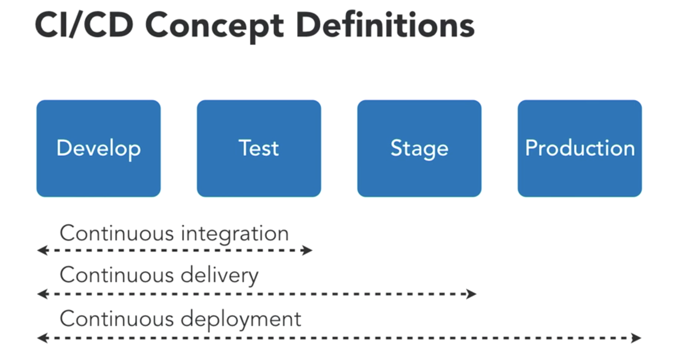

# Jenkins
Tutorial and cheatsheet for Jenkins.

## CI/CD Concept Definitions

- Continuous Integration: Delivery of development and tested code 
- Continuous Delivery: Testing in a production-like environment such as staging, QA or live-sh; delivering something that the DevOps team could take and do something with it in the productions stage but not actually putting it into production
- Continuous Deployment: Development, test, staging and going into production is all automated

### Continuous Deployment vs Delivery
- Delivery has a few manual steps prior to going live in production
- Deployment, the whole pipeline is automated


## Run Jenkins on Docker
```
docker volume create jenkins_persist
docker container run -d \
    -p 8080:8080 \
    -v jenkins_persist:/var/jenkins_home \
    --name jenkins-local \
    jenkins/jenkins:lts
```